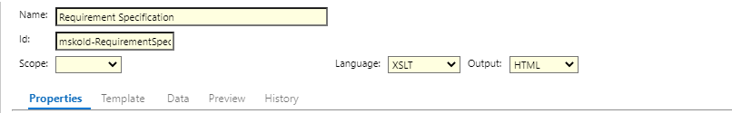
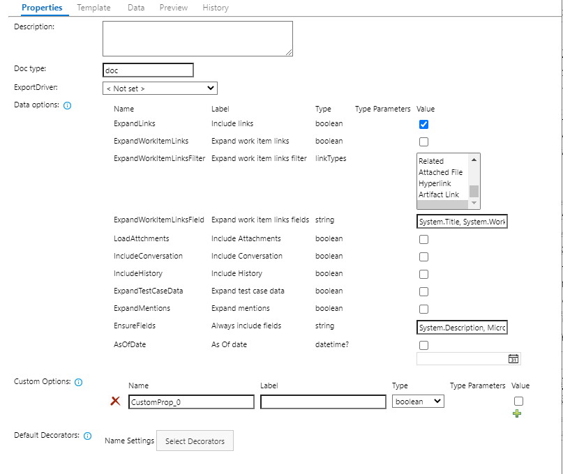
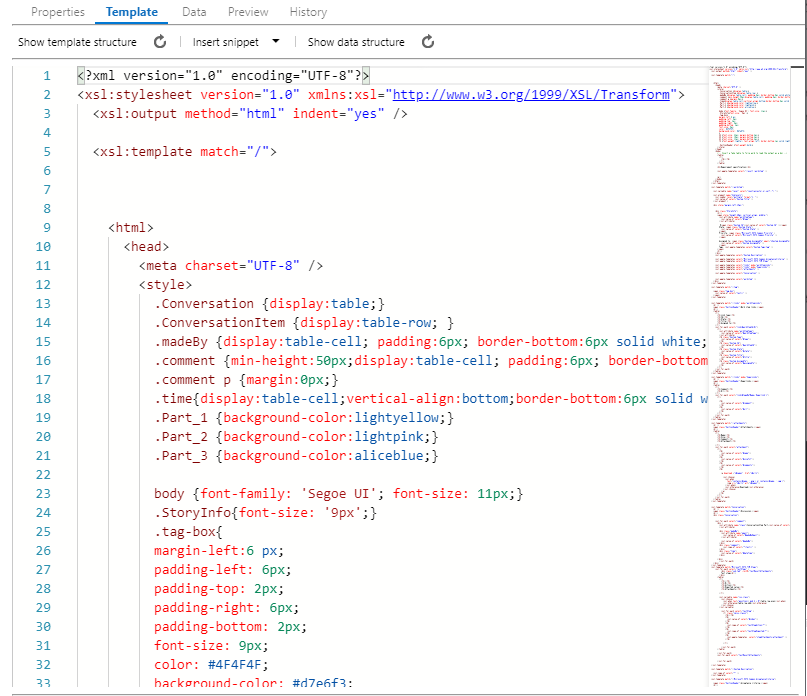
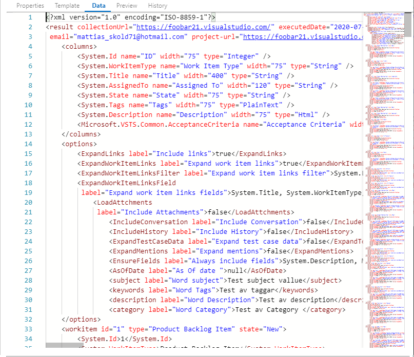
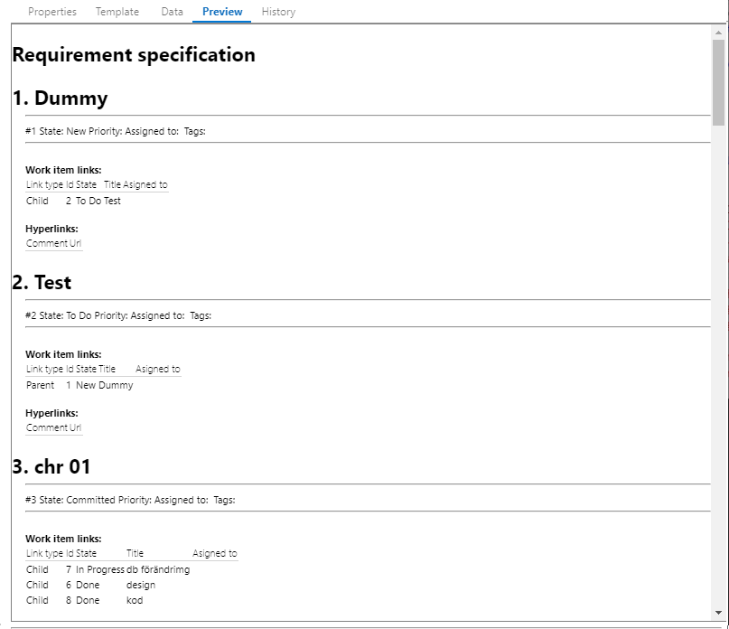
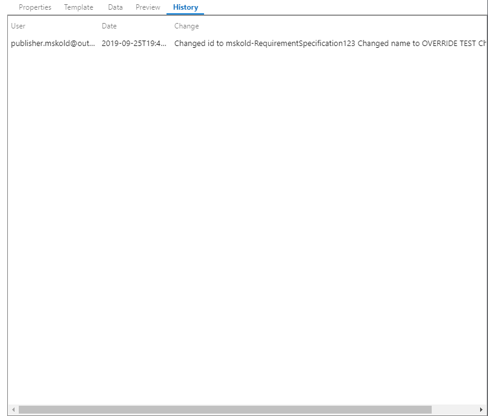

## Introduction
In Enhanced Export PRO, all settings are stored in templates that are accessible to all users.
The extension comes with a set of predefined templates out of the box, intended to showcase the capabilities and serve as a starting point for customers.
You can copy existing templates and modify them, or create new templates with the Admin Hub.
The out-of-the-box templates have the **Default** scope and cannot be overwritten. Users can save templates with the scope **Collection** (visible to all projects), or **Project** (visible only for the current project).

You can navigate to the Admin hub by either clicking the settings gear on the export tab, or by selecting Project settings and then clicking Enhanced Export PRO in the left-hand lower corner.

## Languages 
Enhanced Export PRO uses common, well-known languages for rendering data into a document. There are plenty of resources available on the internet for learning and mastering them; below are just some examples.
* [HTML](https://www.w3schools.com/html)
* [XML](https://www.w3schools.com/xml)
* [XSLT](https://www.w3schools.com/xml/xsl_intro.asp)
* [Handlebars](https://handlebarsjs.com/)

## The Template editor 
The left part of the template editor is the navigation pane, where you can see and select all templates.
It also contains functions for exporting and importing templates, mainly used for moving templates between organizations and for support.

The right part is the edit area for the template. It consists of a common header area and tabs for different parts of the template. At the bottom, you have buttons for **Copying**, **Saving**, and **Deleting** the template. You can also use Ctrl + S to save.

## Common Header 
 

Here you set the Name, Id and scope for your template. By setting the same ID as an out of the box template - you can "override" it with your template. 
You can also choose the language that should be used for your template and the output format of the template.

## Properties tab
 
The properties tab contains the default values for all settings. 

|   |   |
|---|---|
| Description | A general description for the template   |
| DocType | The default file extension used when the user opens/downloads the rendered report |
| Export driver | The default export driver used when the user opens/downloads the rendered report |
| Data options | This sets the default options used for fetching data.  |
| Custom options | You can create your own custom options that you can use for controlling the rendering. |
| Default decorators| Default decorators to be applied once the rendering is complete.  |

## Template tab
This is the editor for the transformation template. 
 

|   |   |
|---|---|
| Show template structure | Shows a tree view of the template structure for ease of understanding and quick navigation. |
| Insert snippet | Inserts XSLT tags for word codes and work item fields   |
| Show data structure| Shows a tree view of the data structure. |

## Data tab
Shows the fetched data for the **latest successful export**
 

## Preview
Preview/test the template and show the results.
 
Clicking the preview will apply the content of the template tab with the content of the Data tab and show the result. This enables you to test your template. 

## History 
Shows the revision history for the template.
 

