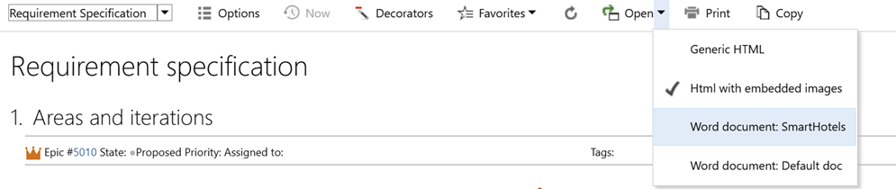

## Introduction
Creating an export is not worth much if you can’t share it with others. Enhanced Export PRO has the capability to save an export as a full fletched word document with the look and feel that you can share across your organization. 

## Saving an export as a word document 
To save your export as a word document, just dop down the Open menu and select one of the uploaded word document templates. 



## Creating your own custom word template
You can simply take your ordinary word document with your organizations logo and styling and convert it to a word template used by Enhanced Export PRO to create its word document. 
Just follow this procedure to create your own template. 
1.	Open an ordinary word document that is according to your organization’s standards and styling
2.	At the location you want the export data to start, enter the text
HTML_CONTENT surrounded by %% on both sides like this.

4. You can use word properties to render data decided at runtime in the word template 
5.	Save the document (as an ordinary word document)   
6.	Go to the admin hub for Enhanced Export PRO
7.	Select the Library tab
8.	Click Add new Library item in the left hand menu
9.	Give your template a name, id and select a scope
10.	Click the Change item button
11.	Upload the document
12.	Click Save
You are now done and can use your word template in Enhanced Export PRO 

## Document properties 
You can use Word document properties to show data in the word template that is populated at runtime 
One example of this is the Title properties. In the word template you can insert the Title property both on the first page, and in headars and/or fotters. 

Then exporting to a word document, the document title peoperty is automnaticly populated bu the Title element, if present, if not the query name Is used. 
By default we populate the following properties  of the exported word document 
*	Title
*	Creator
*	Created
*	Modified 
*	Last modified by 


### Setting document properties in the template 
You can create and set document properties in the exported document by rendering a META tag 
```xml
<meta name="word-properties"  data-propName="Prop value" data-prop2Name="prop 2 value"/>
```

### Setting properties at runtime 
We also push all Options as custom properties, enabling the user to fill values at run time and have them exported as document properties in word. 

### Creating an template that auto updates TOC and fields on open
To automate refreshing the TOC and document fields you need to add a macro named Auto Open to the template. 

### Create an AutoOpen macro  
Create a new macro AutoOpen in the template document Specific (not All or the normal.dotm)


    Sub AutoOpen()
        ActiveDocument.Fields.Update
    End Sub

Save the macro as part of the template documet as a Macro included document (.docm)
Upload the template document as a temlate document in Enhanced Export PRO. 

Make sure that the documents you download from Azure DevOps is trusted 


