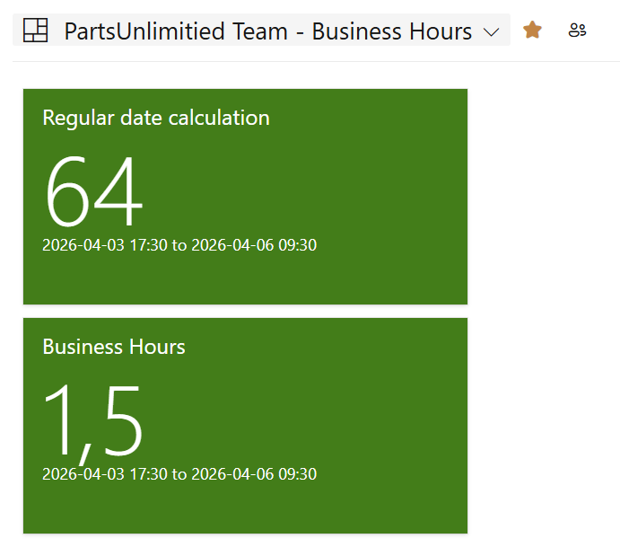
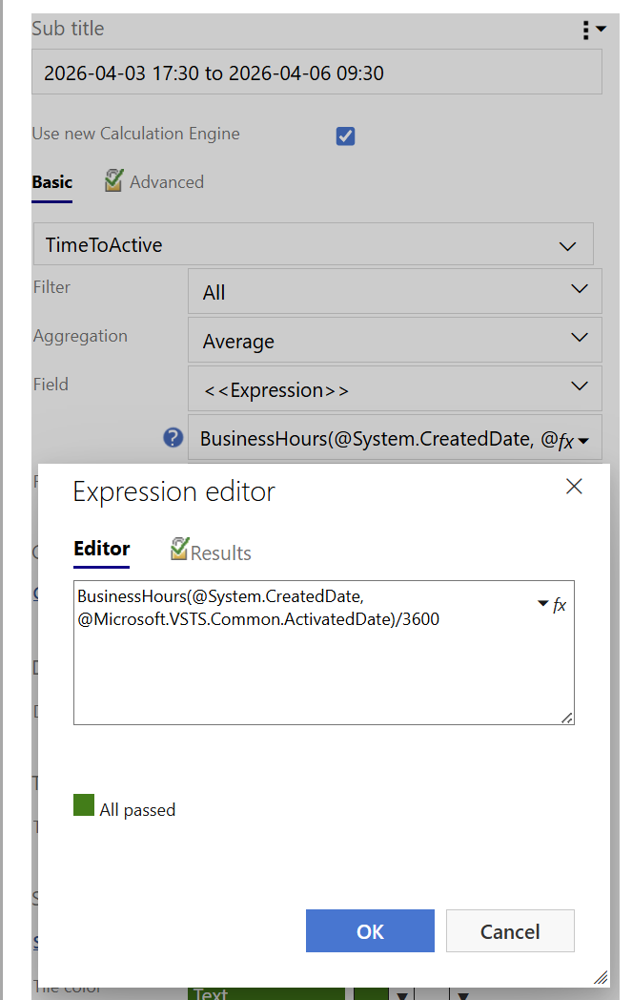
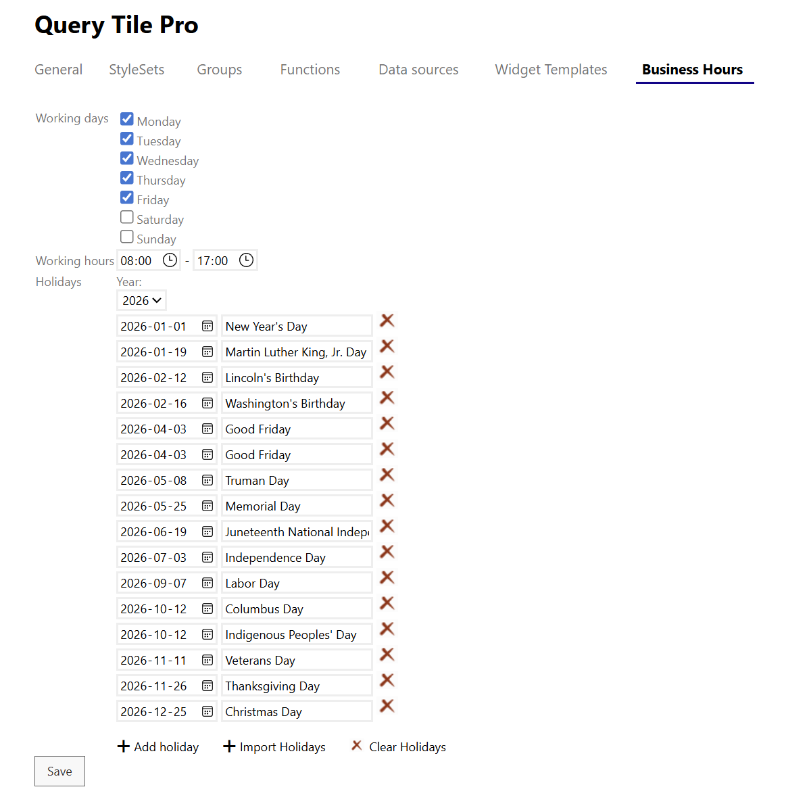

# Introduction

Standard date-time calculations measure all 24 hours—but your dashboards shouldn't. The **Business Hours** paid feature in Query Tile PRO calculates only the time your business is actually working, giving you accurate KPIs that matter.

Without Business Hours, a ticket that arrives Friday at 17:30 and is handled Monday at 09:30 shows as "untouched for 65 hours"—when it's actually only been 2 hours of *business time*. This distorts your metrics and masks real performance issues.

## What You Can Do

With Query Tile PRO's Business Hours feature, you can:
- **Calculate actual business time** between two points (not calendar time)
- **Define your working schedule** with custom business days and hours
- **Account for holidays** with configurable calendar imports
- **Customize by department or location** with different business hour rules

# Real-World Example

Imagine a support ticket scenario:
- **Arrives:** Friday 17:30
- **Addressed:** Monday 09:30
- **Calendar time:** 64 hours
- **Business time (with Business Hours 08:00-17:00):** 1,5 hours

Without this feature, reports show a 65-hour delay. With Business Hours, you see the accurate 1.5 hour response time—which reveals actual performance and helps you set realistic SLAs.

# How to use it 
Simply replace your DateDiff function with the BusinessHours function in your Query Tiles configurations

# How to configure your Business Hours

Business Hours settings are managed through the **Query Tile PRO settings panel**.

## Step 1: Access Business Hours Settings

1. Open a Query Tile PRO component
2. Navigate to **Settings** > **Time Calculations**
3. Toggle **Business Hours** to enable this feature

## Step 2: Define Your Business Days

1. In the Business Hours settings, select which days are working days
2. Common configurations:
   - **5-day week:** Monday–Friday
   - **6-day week:** Monday–Saturday
   - **Custom:** Select specific days (e.g., exclude certain days for rotating schedules)

## Step 3: Set Business Hours

1. Define your **start time** (e.g., 09:00)
2. Define your **end time** (e.g., 17:00)
3. These apply to all business days selected in Step 2

## Step 4: Add Holidays

1. Import the official holidays by clicking the **Import Holidays** button
2. Manually adjust or add other days of 

# Need More Help?

For detailed configuration examples or timezone-specific guidance, see [Getting Started with Query Tile PRO](Getting-started.md) or contact our support team on extension-support@mskold.com.

