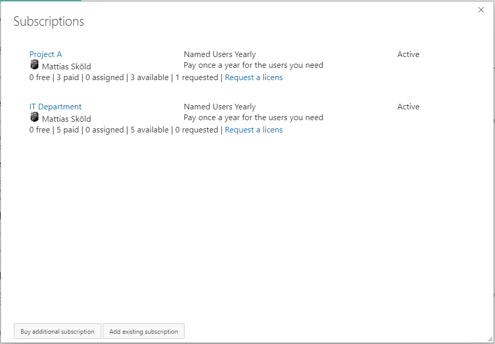
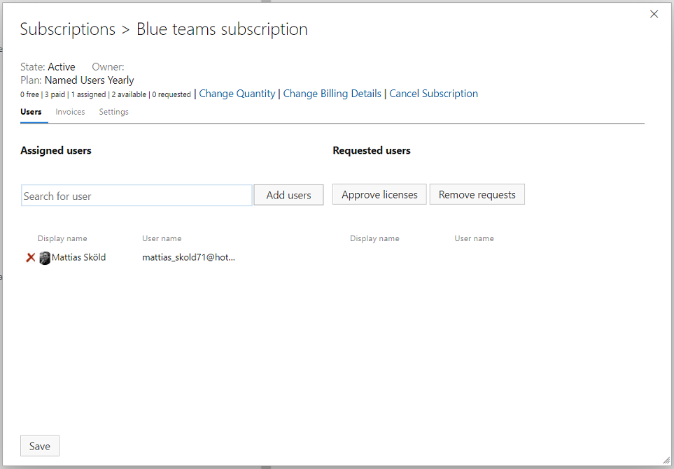

## Managing subscriptions 
Once a subscription has been purchased, you can manage it by navigating to the subscription list page.

### 1. Navigating to your subscription 
This can either be done by:

or by:

### 2. Selecting your subscription 

From the list of subscriptions, click on the subscription you want to manage or change.
From here, you can purchase additional subscriptions or manage existing subscriptions by clicking on them.

### 3. Assign teams to your subscription
Once purchased, you need to assign teams to your subscription. You can change the assigned teams at any time.

You can either search for teams (part of any team in any project) or approve requests from teams requesting a license.

**Auto-approval of license requests**
Subscription owners can also turn on auto-approval for licensing requests on the settings tab. By doing so, the need for manual intervention when assigning a team to a license is removed.
With auto-approval turned on, unlicensed teams requesting a license will be directly assigned a license and taken to the export tab, provided that the subscription has available teams to assign.

### 4. Change the number of purchased teams. 
At the top of your subscription, there are links to **change the quantity**.
All changes to the quantity are applied directly and will result in a new invoice with prorated charges.
If you want to avoid an extra invoice, please reach out to extension-support@mskold.com and we will assist you.

### 5. Change billing details. 
At the top of your subscription, there are links to **change billing details**. This will open up a form.
If you need to change the card information on file, the simplest way is to send an email to extension-support@mskold.com and we will send a secure link for updating the card details.

### 6. Change the subscription owner 
To change the subscription owner, go to the subscription settings tab and select a new owner from the dropdown list.

### 7. Cancel a subscription 
At the top of your subscription, there are links to **cancel the subscription**. This will open up a form for submitting your cancellation.
Please provide the reason for canceling, and note that the cancellation will take effect immediately.
If you want the subscription canceled at the end of the term or on a specific date, please reach out to extension-support@mskold.com and we will assist you.

