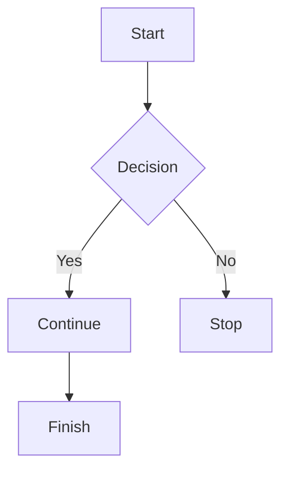
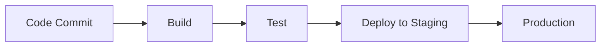

## Introduction
Mermaid is a text-based diagramming syntax that lets you create a wide range of charts and diagrams.
Azure DevOps has limited support for Mermaid diagrams, especially in on-premises versions of Azure DevOps Server, where support typically covers only 4–11 of the 21+ diagram types available in Mermaid.

WikiPRO supports the latest version of Mermaid and all 21+ diagram types available in both Azure DevOps and Azure DevOps Server.
WikiPRO also supports a more modern Markdown syntax for Mermaid charts.

````markdown

````

## Supported diagram types
WikiPRO supports the following diagram types:
- Flowchart (`flowchart`)
- Sequence Diagram (`sequenceDiagram`)
- Class Diagram (`classDiagram`)
- State Diagram (`stateDiagram-v2`)
- Entity Relationship Diagram (ERD) (`erDiagram`)
- User Journey Diagram (`journey`)
- Gantt Chart (`gantt`)
- Pie Chart (`pie`)
- Quadrant Chart (`quadrantChart`)
- Requirement Diagram (`requirementDiagram`)
- Git Graph (`gitGraph`)
- C4 Diagram (`C4Context`, `C4Container`, `C4Component`, `C4Dynamic`, `C4Deployment`)
- Mind Map (`mindmap`)
- Timeline (`timeline`)
- ZenUML Diagram (`zenuml`)
- Sankey Diagram (`sankey-beta`)
- XY Chart (`xychart-beta`)
- Block Diagram (`block-beta`)
- Packet Diagram (`packet-beta`)
- Kanban Board (`kanban`)
- Architecture Diagram (`architecture-beta`)
- Radar Chart (`radar-beta`)
- Treemap (`treemap`)

By embedding Mermaid code blocks in your wiki content, you can maintain diagrams as source text, making them easier to version, review, and update.

## Creating a Mermaid diagram in the rich text editor
Click the Mermaid icon in the toolbar, then select **Edit** on the inserted chart.

## Creating a Mermaid diagram in the Markdown editor
To create a Mermaid diagram, add a fenced code block and specify `mermaid` as the language.

### Example: Flowchart

````markdown

````

## Using Mermaid in documentation

Mermaid diagrams are particularly useful for:

* Application architecture documentation
* Deployment workflows
* CI/CD pipelines
* Business process diagrams
* System integrations
* Database relationship diagrams
* Project timelines

Example CI/CD pipeline:

````markdown

````

---

## Additional resources

For advanced diagram syntax, consult the official Mermaid documentation.
